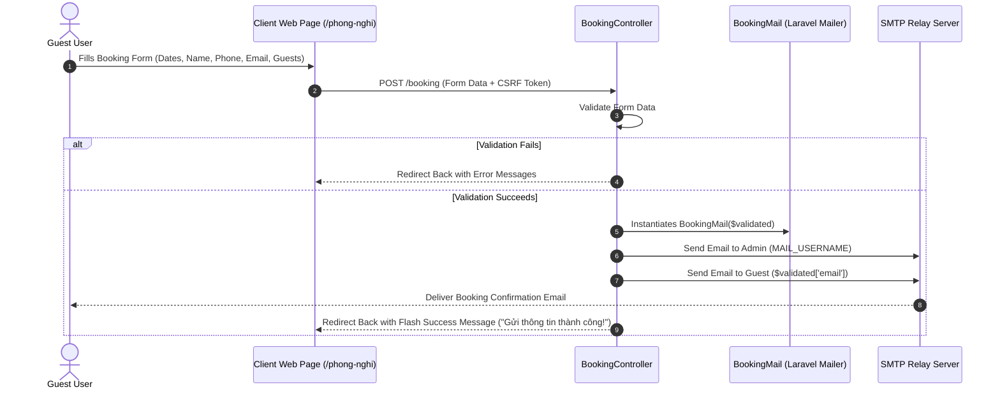
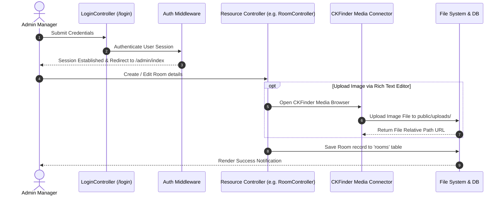
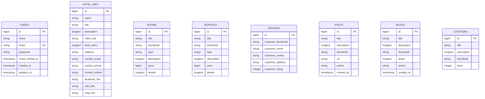

# System Architecture

This document details the architectural design, component flow, data relationships, and infrastructure layer of the **Sapa Cosy Hotel** web application.

---

## 🏗️ 1. High-Level Architecture

The application follows the classic **Model-View-Controller (MVC)** architectural pattern provided by Laravel 11. It operates as a full-stack monolithic application serving Blade templates directly to client browsers while handling backend data management, mail dispatching, and media storage.

### High-Level Component Diagram

```mermaid
graph TD
    Client["Client Browser (Guest)"] -->|HTTP / HTTPS| WebServer["Web Server (Nginx / Apache)"]
    Admin["Admin User (Manager)"] -->|HTTPS (Auth Protected)| WebServer
    
    subgraph LaravelApp ["Laravel 11 Application Container"]
        Router["Route Dispatcher (routes/web.php)"]
        Middleware["Auth & Session Middleware"]
        
        subgraph Controllers ["Controllers Layer"]
            ClientCtrl["Client Controllers (HomeController, BookingController)"]
            AdminCtrl["Admin Controllers (RoomController, BlogController, etc.)"]
            AuthCtrl["Auth Controllers (LoginController)"]
        end
        
        subgraph ServicesLayer ["Services & Integration"]
            Mailer["Laravel Mailer (BookingMail)"]
            CKFinder["CKFinder Package (Media Management)"]
        end
        
        subgraph StorageLayer ["Data & Storage Layer"]
            QueryBuilder["Query Builder / DB Facade"]
            DB[(MySQL / MariaDB)]
            FileStorage["Local Disk Storage (public/storage)"]
        end
    end
    
    WebServer --> Router
    Router --> Middleware
    Middleware --> AuthCtrl
    Middleware --> ClientCtrl
    Middleware --> AdminCtrl
    
    ClientCtrl --> Mailer
    AdminCtrl --> CKFinder
    
    ClientCtrl --> QueryBuilder
    AdminCtrl --> QueryBuilder
    
    QueryBuilder --> DB
    CKFinder --> FileStorage
    Mailer -->|SMTP| ExternalSMTP["SMTP Server (Gmail / Mailgun)"]
    ExternalSMTP -->|Email Delivery| GuestInbox["Guest & Admin Inbox"]
```

---

## 🔄 2. Core Workflows & Data Flow

### 2.1 Public Guest Booking Workflow



### 2.2 Admin Content Management & Media Workflow



---

## 🗄️ 3. Entity Relationship & Database Schema

The database design links hotel operations, guest reviews, marketing blogs, press publications, and location guides.



---

## 🔐 4. Security Architecture

1. **Session & Authentication**:
   - Web guard standard Laravel authentication (`Illuminate\Support\Facades\Auth`).
   - Admin routes scoped behind `Route::middleware('auth')`.
2. **Data Sanitization & Injection Protection**:
   - Laravel Query Builder parameterized queries protect against SQL injection.
   - Blade `{{ $variable }}` auto-escaping prevents Cross-Site Scripting (XSS).
3. **File Upload Security**:
   - CKFinder security configuration limits uploaded file extensions and execution permissions in public upload folders.
